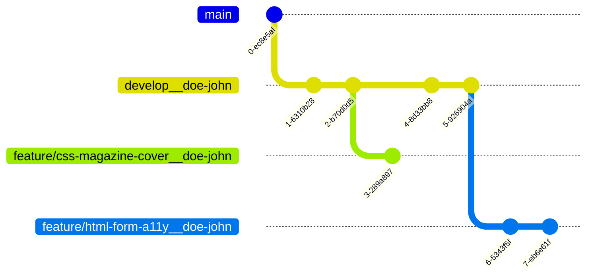

# nodo-frontend-workshop
It is a collection of workshops to learn frontend topics. 🧑‍💻🎨

1. First at all, the developer needs to create its own develop branch:

  For example:
  - john_doe@mail.com: *develop__doe-john*
  - Jane Doe: *develop__doe-jane*

From the **main** branch put the next command: `git checkout -b "develop-doe-john"`

2. After that, each developer have to create their own folder and add `.gitkeep` file:

For example:
- John Doe: *doe_john/.gitkeep*
- Jane Doe: *doe_jane/.gitkeep*

Then the developer add and commit the changes:

`git add . && git commit -m "feat: "` or `git checkout -b "develop-doe-john"`

